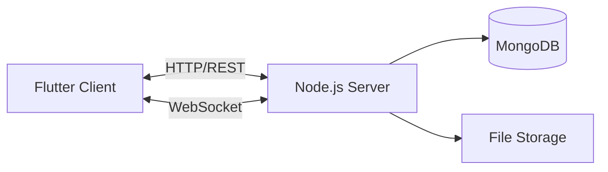
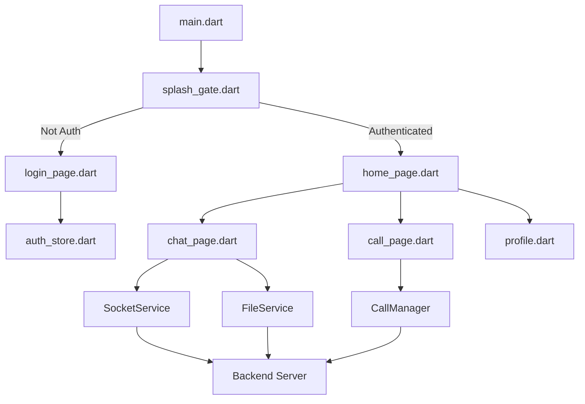
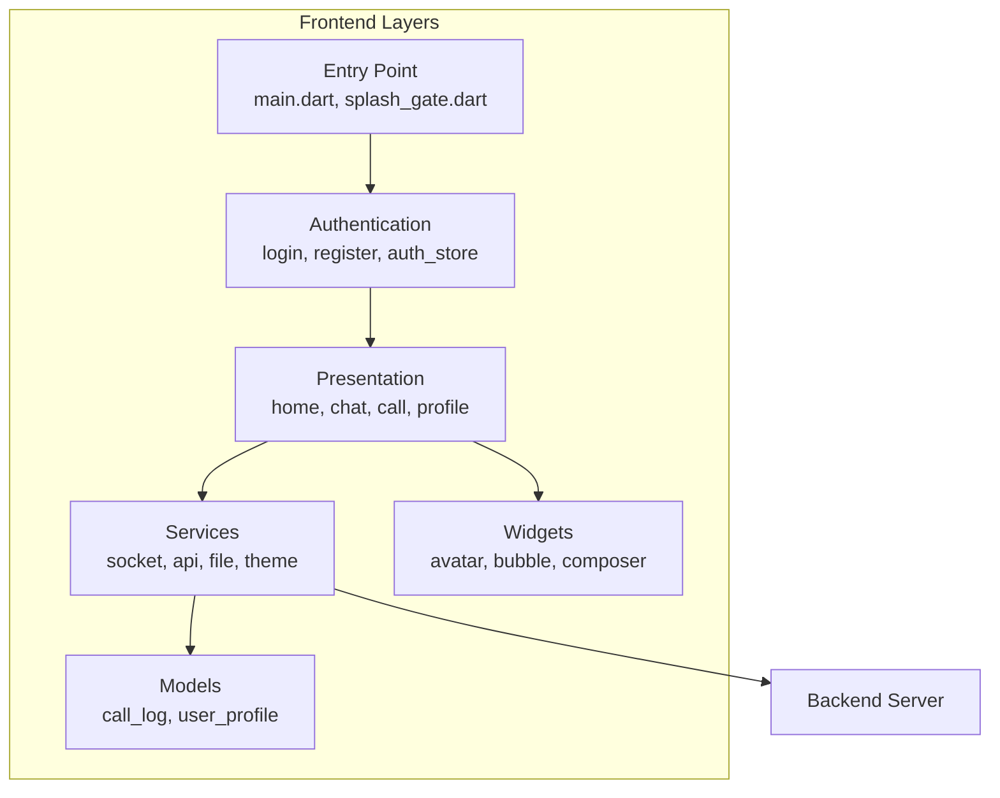
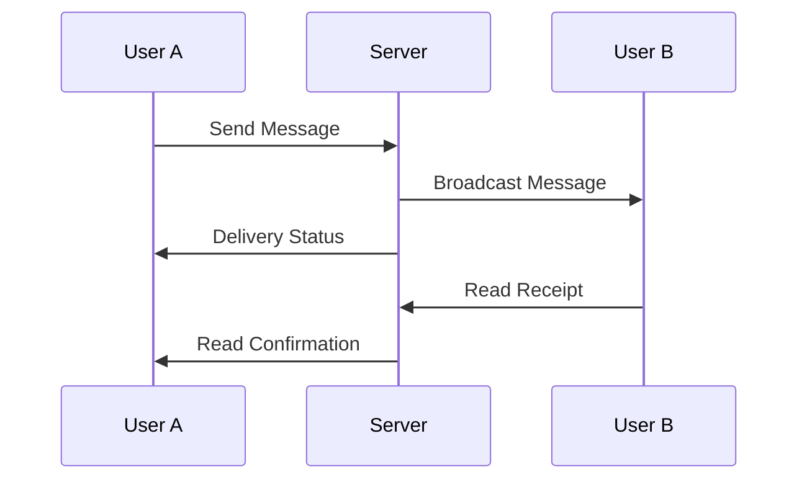
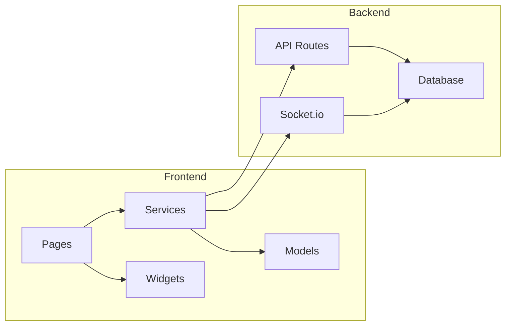
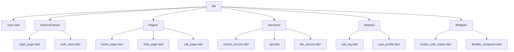

# Messaging App - Visual Diagrams

## System Architecture Diagram



## Application Flow Diagram



## Frontend Layer Architecture



## Real-time Messaging Flow



## Call System Flow

```mermaid
sequenceDiagram
    participant U1 as User A
    participant S as Server
    participant U2 as User B
    
    U1->>S: Call Request
    S->>U2: Incoming Call
    U2->>S: Accept Call
    S->>U1: WebRTC Offer
    S->>U2: WebRTC Answer
    U1<->>U2: P2P Connection
```

## Component Structure



## File Structure Tree


